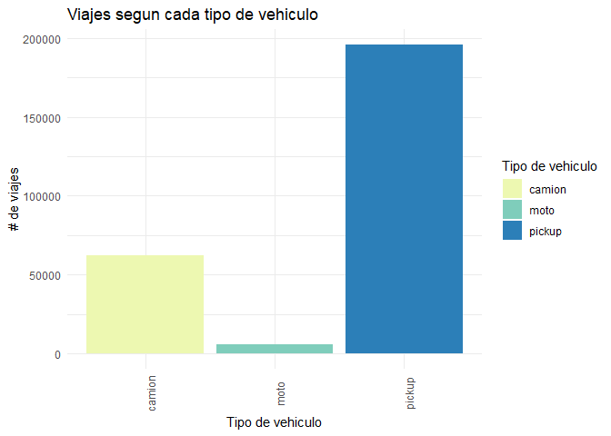
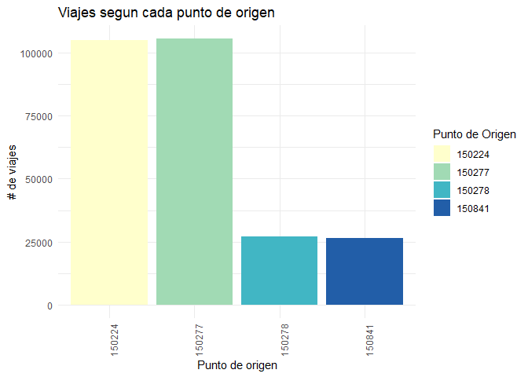
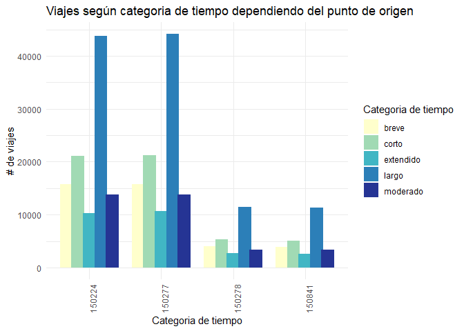
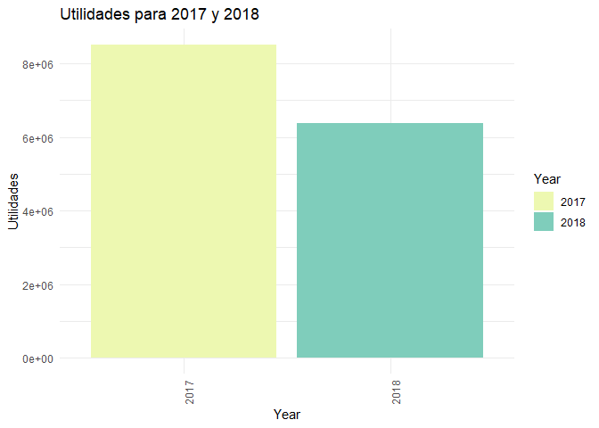
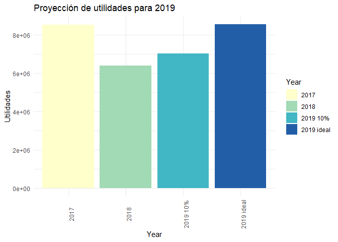
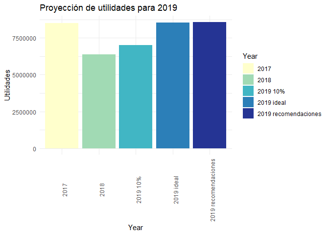

# Inversiones en Energía, S.A. de C.V. - Informe de Operaciones 2017

### Resumen

En este informe de operaciones se analizaron las ventas de 2017 para
poder tener insights hacia que fue lo que afectaron las ventas de 2018 y
poder tomar como ejemplo el año 2017 para poder aumentar el margen
operativo en 2019 y lograr un funcionamiento eficiente de la empresa

### Supuestos

Se asumio que las columnas que indicaban cuanto se tardaban en llegar
hablaban en términos de minutos y se generó categorías para poder hacer
referencia a estos de manera más fácil. Las categorías serán de la
siguiente manera:

| minutos | categoría |
|---------|-----------|
| 5-30    | breve     |
| 30-45   | corto     |
| 45-75   | moderado  |
| 75-120  | largo     |
| 120+    | extendido |

### Resultados

##### Hipotesis 1: Las motos son el vehiculo más eficiente

Primero se desea ver el margen de utilidad de los diferentes servicios
que se prestan:

<table>
<thead>
<tr>
<th style="text-align:left;">
Cod
</th>
<th style="text-align:right;">
ingresos_cod
</th>
<th style="text-align:right;">
costos_cod
</th>
<th style="text-align:right;">
utilidad_cod
</th>
<th style="text-align:left;">
margen_ut_cod
</th>
</tr>
</thead>
<tbody>
<tr>
<td style="text-align:left;">
REVISION
</td>
<td style="text-align:right;">
Q11,968,468.31
</td>
<td style="text-align:right;">
Q9,316,398.31
</td>
<td style="text-align:right;">
Q2,652,070.00
</td>
<td style="text-align:left;">
0.22
</td>
</tr>
<tr>
<td style="text-align:left;">
VERIFICACION_MEDIDORES
</td>
<td style="text-align:right;">
Q6,236,957.69
</td>
<td style="text-align:right;">
Q4,871,796.69
</td>
<td style="text-align:right;">
Q1,365,161.00
</td>
<td style="text-align:left;">
0.22
</td>
</tr>
<tr>
<td style="text-align:left;">
VERIFICACION_INDICADORES
</td>
<td style="text-align:right;">
Q4,530,103.04
</td>
<td style="text-align:right;">
Q3,485,922.04
</td>
<td style="text-align:right;">
Q1,044,181.00
</td>
<td style="text-align:left;">
0.23
</td>
</tr>
<tr>
<td style="text-align:left;">
CAMBIO_CORRECTIVO
</td>
<td style="text-align:right;">
Q4,465,829.76
</td>
<td style="text-align:right;">
Q3,454,820.76
</td>
<td style="text-align:right;">
Q1,011,009.00
</td>
<td style="text-align:left;">
0.23
</td>
</tr>
<tr>
<td style="text-align:left;">
CAMBIO_FUSIBLE
</td>
<td style="text-align:right;">
Q2,936,607.72
</td>
<td style="text-align:right;">
Q2,082,330.72
</td>
<td style="text-align:right;">
Q854,277.00
</td>
<td style="text-align:left;">
0.29
</td>
</tr>
<tr>
<td style="text-align:left;">
VISITA_POR_CORRECCION
</td>
<td style="text-align:right;">
Q2,912,253.76
</td>
<td style="text-align:right;">
Q2,170,255.76
</td>
<td style="text-align:right;">
Q741,998.00
</td>
<td style="text-align:left;">
0.25
</td>
</tr>
<tr>
<td style="text-align:left;">
REVISION_TRANSFORMADOR
</td>
<td style="text-align:right;">
Q1,970,485.62
</td>
<td style="text-align:right;">
Q1,527,696.62
</td>
<td style="text-align:right;">
Q442,789.00
</td>
<td style="text-align:left;">
0.22
</td>
</tr>
<tr>
<td style="text-align:left;">
OTRO
</td>
<td style="text-align:right;">
Q1,037,758.37
</td>
<td style="text-align:right;">
Q778,511.37
</td>
<td style="text-align:right;">
Q259,247.00
</td>
<td style="text-align:left;">
0.25
</td>
</tr>
<tr>
<td style="text-align:left;">
CAMBIO_PUENTES
</td>
<td style="text-align:right;">
Q325,281.38
</td>
<td style="text-align:right;">
Q250,407.38
</td>
<td style="text-align:right;">
Q74,874.00
</td>
<td style="text-align:left;">
0.23
</td>
</tr>
<tr>
<td style="text-align:left;">
VISITA
</td>
<td style="text-align:right;">
Q304,350.66
</td>
<td style="text-align:right;">
Q235,879.66
</td>
<td style="text-align:right;">
Q68,471.00
</td>
<td style="text-align:left;">
0.22
</td>
</tr>
</tbody>
</table>

Se puede ver que todos los servicios marginan de una manera similar
manteniendose en los 20% por lo que se va a analizar eficiencia y
efectividad en cuanto a los tipos de vehiculos que se utilizan:

<!-- -->
<table>
<thead>
<tr>
<th style="text-align:left;">
vehiculo
</th>
<th style="text-align:right;">
ingresos_veh
</th>
<th style="text-align:right;">
costos_veh
</th>
<th style="text-align:right;">
utilidad_veh
</th>
<th style="text-align:left;">
margen_ut_veh
</th>
</tr>
</thead>
<tbody>
<tr>
<td style="text-align:left;">
pickup
</td>
<td style="text-align:right;">
Q24,502,084.21
</td>
<td style="text-align:right;">
Q19,121,908.21
</td>
<td style="text-align:right;">
Q5,380,176.00
</td>
<td style="text-align:left;">
0.22
</td>
</tr>
<tr>
<td style="text-align:left;">
camion
</td>
<td style="text-align:right;">
Q11,461,980.20
</td>
<td style="text-align:right;">
Q8,658,363.20
</td>
<td style="text-align:right;">
Q2,803,617.00
</td>
<td style="text-align:left;">
0.24
</td>
</tr>
<tr>
<td style="text-align:left;">
moto
</td>
<td style="text-align:right;">
Q724,031.90
</td>
<td style="text-align:right;">
Q393,747.90
</td>
<td style="text-align:right;">
Q330,284.00
</td>
<td style="text-align:left;">
0.46
</td>
</tr>
</tbody>
</table>

Como se puede ver actualmente el más utilizado es el pickup y por ende,
este es el que genera más utilidades. Sin embargo, el que tiene mejor
margen de utilidad es la moto pero es utilizado muy pocas veces. Esto
llevo a investigar si se podrían hacer algunos cambios en los viajes
para aprovechar el margen de la moto.

<table>
<thead>
<tr>
<th style="text-align:left;">
Cod
</th>
<th style="text-align:right;">
camion
</th>
<th style="text-align:right;">
moto
</th>
<th style="text-align:right;">
pickup
</th>
</tr>
</thead>
<tbody>
<tr>
<td style="text-align:left;">
CAMBIO_CORRECTIVO
</td>
<td style="text-align:right;">
1325
</td>
<td style="text-align:right;">
NA
</td>
<td style="text-align:right;">
34544
</td>
</tr>
<tr>
<td style="text-align:left;">
CAMBIO_FUSIBLE
</td>
<td style="text-align:right;">
8815
</td>
<td style="text-align:right;">
5725
</td>
<td style="text-align:right;">
4604
</td>
</tr>
<tr>
<td style="text-align:left;">
CAMBIO_PUENTES
</td>
<td style="text-align:right;">
1326
</td>
<td style="text-align:right;">
NA
</td>
<td style="text-align:right;">
513
</td>
</tr>
<tr>
<td style="text-align:left;">
OTRO
</td>
<td style="text-align:right;">
5694
</td>
<td style="text-align:right;">
NA
</td>
<td style="text-align:right;">
177
</td>
</tr>
<tr>
<td style="text-align:left;">
REVISION
</td>
<td style="text-align:right;">
9861
</td>
<td style="text-align:right;">
NA
</td>
<td style="text-align:right;">
80427
</td>
</tr>
<tr>
<td style="text-align:left;">
REVISION_TRANSFORMADOR
</td>
<td style="text-align:right;">
5576
</td>
<td style="text-align:right;">
NA
</td>
<td style="text-align:right;">
6956
</td>
</tr>
<tr>
<td style="text-align:left;">
VERIFICACION_INDICADORES
</td>
<td style="text-align:right;">
9665
</td>
<td style="text-align:right;">
NA
</td>
<td style="text-align:right;">
22255
</td>
</tr>
<tr>
<td style="text-align:left;">
VERIFICACION_MEDIDORES
</td>
<td style="text-align:right;">
3504
</td>
<td style="text-align:right;">
NA
</td>
<td style="text-align:right;">
43889
</td>
</tr>
<tr>
<td style="text-align:left;">
VISITA
</td>
<td style="text-align:right;">
183
</td>
<td style="text-align:right;">
NA
</td>
<td style="text-align:right;">
2188
</td>
</tr>
<tr>
<td style="text-align:left;">
VISITA_POR_CORRECCION
</td>
<td style="text-align:right;">
16318
</td>
<td style="text-align:right;">
NA
</td>
<td style="text-align:right;">
180
</td>
</tr>
</tbody>
</table>

Actualmente, la moto solo es utilizada solo en el 2% de los viajes a
comparación del pickup que es utilizado para el 74% de los viajes.

Por esto se decidió considerar como afectaría a los costos variables o
directos para los viajes de verificación y visita, ya que se considera
que para estos no se necesitaría mucho equipo o materiales a parte por
lo que si se podría realizar el viaje en moto.

Actualmente se realizan 29,670 viajes de este tipo en camión y 68,512 en
pickup, lo que lleva a unos costos variables totales de 2,620,158 y
4,251,170 respectivamente. Si se hiciera el cambio para estos viajes se
vería una baja de costos de 29,670 y 68,512 respectivamente, para unos
costos variables totales de 1,295,096 y 2,990,549 respectivamente

##### Hipotesis 2: los centros de distribución no son utilizados de manera eficiente

<!-- -->

Se puede observar que los viajes que bien distribuidos entre los centros
de origen. Los centros de origen 224 y 277 manejan un 80% entre los dos,
mientras que el 278 y 841 manejan solo el 20%, lo que signifca que no se
estan utilizando estos centros de la manera más eficiente posible.

<!-- -->

Investigando más profundo se encontró que la mayoría de viajes caen en
la categoría de tiempo “largo” es decir que el técnico toma entre 75 y
120 minutos en llegar a la ubicación del poste y este es el caso para
los 4 centros de origen.

Primero, al tener los centros tan alejados se incurren en costos
variables más altos con costos variables de 3,492,265 y 3,466,953
actuales en los dos centros de origen más utilizados para estos viajes.
Tan solo con cambiar al centro a un lugar donde estos viajes queden en
categoría de un viaje “moderado” se ve una baja en los costos de
1,046,355 y 1,038,771 respectivamente. Si se cambia de ubicación para la
categoría de “corto” se llevaría a una baja en costos variables de
1,573,065 y 1,561,663 respectivamente.

Por ultimo se puede ver que la mayoría de estos viajes “largos” son
hechos en un pickup para hacer revisiones y verificaciones, donde ya se
habia mencionado anteriormente que se podría reducir costos utilizando
una moto. Esto lleva a concluir que ni los centros de origen ni los
recorridos se estan haciendo de manera efectiva.

##### Estrategias a seguir para llegar a niveles de 2017 en 2019

Primero, se necesita saber con cuánto se trabajo en 2017 y 2018:

<!-- -->

Para referencia, si se logrará aumentar el 10% en 2019 y llegar a los
niveles de 2017 se vería de la siguiente manera:

<!-- -->

Como ya se sabía, en 2018 se vió una baja del 25% en las utilidades. Se
podría hacer el supuesto que los ingresos o servicios dados por la
empresa se mantienen similares año por año ya que los postes de luz no
son tan fácil de cambiar o decidir dejar de pagar, por lo que las bajas
de 2018 se deben a un aumento de costos. Si se asume que tuvieron
ingresos similares los costos quedarían de la siguiente manera

    ## [1] "Los costos de 2018 fueron: Q30,302,538.56"

    ## [1] "Los costos de 2019 deberian de ser: Q29,663,982.78"

La diferencia de costos es de 2.11%, por lo que hay que lograr que los
costos de 2018 bajen en esa cantidad.

Según los cambios que se sugirieron actualmente, si se implementaran se
llegaría a una baja de costos de 2,183,308 que llevaría incluso a una
utilidad más alta de ese 10%, es mas se llegan a niveles similares que
en 2017, con una utilidad de 8,568,865.75

<!-- -->

### Conclusiones y recomendaciones

- Hacer el cambio para que los viajes que sean de verificación y visita
  sean llevados exclusivamente en motos
- Ya sea abrir nuevos centros de distribución a un lugar más cercano a
  la donde se hacen la mayoría de viajes o reubicar los centros de
  distribución que no son tan utilizados actualmente
