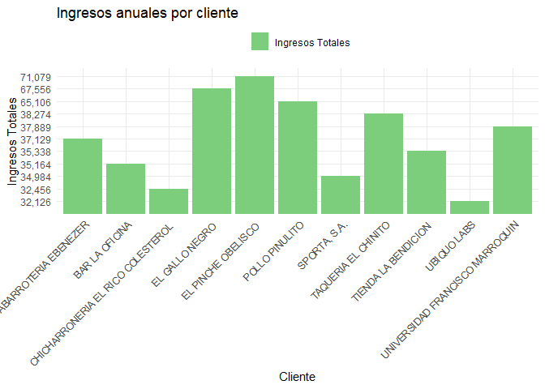
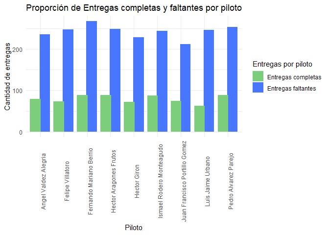
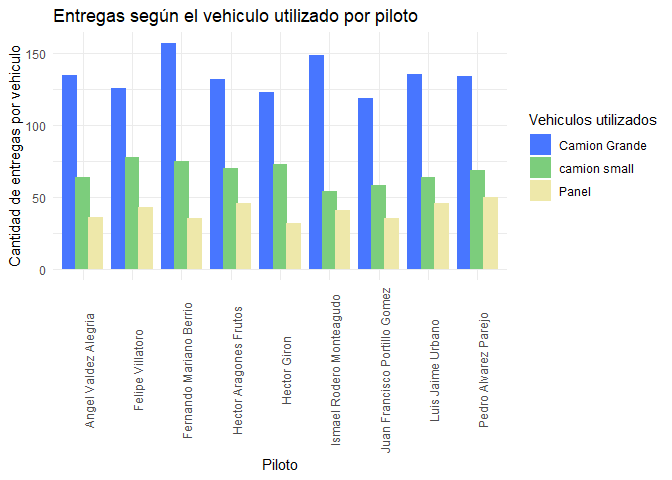

# 

# Informe de Entregas 2017

### Resumen

Este informe está dirigido para una reunión en conjunto del gerente del
departamento de entregas y la junta directiva de Dunder Mifflin, una
empresa que elabora y distribuye productos de papel. Se elaboró con el
fin de poder dar una explicación viable en cuanto a entregas de
mercancía faltantes, eficiencia de pilotos y vehículos y el
comportamiento del 20% más importante de nuestros clientes, todo desde
un punto de vista de entregas. se encontró que las ventas no siguen el
80/20 de Pareto, que no hay un patrón de comportamiento sospechoso
dentro de los pilotos y la inversión en camiones grandes podría llevar a
aumentar la eficiencia de viajes diarios.

### Supuestos

Para poder llevar a cabo la investigación, se trabajó bajo los
siguientes supuestos:

Para poder llevar a cabo la investigación, se trabajó bajo los
siguientes supuestos:

- Se trabajo con una base de datos de 2180 viajes de enero a noviembre
  en 2017
- Se contaban con datos como cantidad y monto de cada entrega, el
  cliente a quien fue entregado y quién realizó la entrega y con qué
  vehículo
- El término “FALTANTE” se utilizó para indicar las entregas que no
  llegaron completas al cliente, es decir, con mercancía de menos que la
  que habían ordenado
- El término “DEVOLUCION” se utilizó para indicar las entregas que
  fueron devueltas por el cliente después de haber hecho la entrega
- El término “Despacho al cliente” se utilizó para indicar que estas
  ordenes fueron enviadas al cliente, pero como se está trabajando con
  una base de datos de entregas se asumió que las que todas las ordenes
  fueron despachas al cliente

### Resultados

##### Hipótesis 1: Existe una diferencia significativa en el volumen promedio de pedidos entre el grupo de los principales clientes (el 20% superior) y el grupo de los demás clientes (el 80% restante)

<table>
<thead>
<tr>
<th style="text-align:left;">
cliente
</th>
<th style="text-align:left;">
ingresos_totales
</th>
<th style="text-align:left;">
unidades_totales
</th>
<th style="text-align:left;">
pedidos_totales
</th>
<th style="text-align:left;">
porcentaje
</th>
</tr>
</thead>
<tbody>
<tr>
<td style="text-align:left;">
EL PINCHE OBELISCO
</td>
<td style="text-align:left;">
71,079
</td>
<td style="text-align:left;">
284,316
</td>
<td style="text-align:left;">
256
</td>
<td style="text-align:left;">
11.87%
</td>
</tr>
<tr>
<td style="text-align:left;">
EL GALLO NEGRO
</td>
<td style="text-align:left;">
67,556
</td>
<td style="text-align:left;">
270,222
</td>
<td style="text-align:left;">
245
</td>
<td style="text-align:left;">
11.28%
</td>
</tr>
<tr>
<td style="text-align:left;">
POLLO PINULITO
</td>
<td style="text-align:left;">
65,106
</td>
<td style="text-align:left;">
260,422
</td>
<td style="text-align:left;">
228
</td>
<td style="text-align:left;">
10.87%
</td>
</tr>
<tr>
<td style="text-align:left;">
TAQUERIA EL CHINITO
</td>
<td style="text-align:left;">
38,274
</td>
<td style="text-align:left;">
153,096
</td>
<td style="text-align:left;">
139
</td>
<td style="text-align:left;">
6.39%
</td>
</tr>
<tr>
<td style="text-align:left;">
UNIVERSIDAD FRANCISCO MARROQUIN
</td>
<td style="text-align:left;">
37,889
</td>
<td style="text-align:left;">
151,557
</td>
<td style="text-align:left;">
134
</td>
<td style="text-align:left;">
6.33%
</td>
</tr>
<tr>
<td style="text-align:left;">
ABARROTERIA EBENEZER
</td>
<td style="text-align:left;">
37,129
</td>
<td style="text-align:left;">
148,516
</td>
<td style="text-align:left;">
131
</td>
<td style="text-align:left;">
6.20%
</td>
</tr>
<tr>
<td style="text-align:left;">
TIENDA LA BENDICION
</td>
<td style="text-align:left;">
35,338
</td>
<td style="text-align:left;">
141,352
</td>
<td style="text-align:left;">
129
</td>
<td style="text-align:left;">
5.90%
</td>
</tr>
<tr>
<td style="text-align:left;">
BAR LA OFICINA
</td>
<td style="text-align:left;">
35,164
</td>
<td style="text-align:left;">
140,654
</td>
<td style="text-align:left;">
134
</td>
<td style="text-align:left;">
5.87%
</td>
</tr>
<tr>
<td style="text-align:left;">
SPORTA, S.A.
</td>
<td style="text-align:left;">
34,984
</td>
<td style="text-align:left;">
139,937
</td>
<td style="text-align:left;">
124
</td>
<td style="text-align:left;">
5.84%
</td>
</tr>
<tr>
<td style="text-align:left;">
CHICHARRONERIA EL RICO COLESTEROL
</td>
<td style="text-align:left;">
32,456
</td>
<td style="text-align:left;">
129,825
</td>
<td style="text-align:left;">
114
</td>
<td style="text-align:left;">
5.42%
</td>
</tr>
<tr>
<td style="text-align:left;">
UBIQUO LABS
</td>
<td style="text-align:left;">
32,126
</td>
<td style="text-align:left;">
128,503
</td>
<td style="text-align:left;">
127
</td>
<td style="text-align:left;">
5.36%
</td>
</tr>
<tr>
<td style="text-align:left;">
UBIQUO LABS
</td>
<td style="text-align:left;">
32,125
</td>
<td style="text-align:left;">
128,500
</td>
<td style="text-align:left;">
114
</td>
<td style="text-align:left;">
5.36%
</td>
</tr>
<tr>
<td style="text-align:left;">
TAQUERIA EL CHINITO
</td>
<td style="text-align:left;">
30,862
</td>
<td style="text-align:left;">
123,446
</td>
<td style="text-align:left;">
108
</td>
<td style="text-align:left;">
5.15%
</td>
</tr>
<tr>
<td style="text-align:left;">
HOSPITAL ROOSEVELT
</td>
<td style="text-align:left;">
26,276
</td>
<td style="text-align:left;">
105,103
</td>
<td style="text-align:left;">
105
</td>
<td style="text-align:left;">
4.39%
</td>
</tr>
<tr>
<td style="text-align:left;">
HOSPITAL LAS AMERICAS
</td>
<td style="text-align:left;">
22,486
</td>
<td style="text-align:left;">
89,944
</td>
<td style="text-align:left;">
92
</td>
<td style="text-align:left;">
3.75%
</td>
</tr>
</tbody>
</table>

<!-- -->

Con la data presentada, se puede observar que en este caso los clientes
de Dundler Mifflin no cumplen con la ley de Pareto, ya que el 20% de los
clientes: El Pinche, El Gallo Negro y Pollo Pinulito no generan el 80%
de los ingresos de la empresa. Sino que 11 empresas (las mostradas en la
gráfica) generan el 80% de los ingresos. Por lo que se deben de tomar
medidas para quedar bien con estas 11 empresas.

##### Hipótesis 2: Existe una un patrón o relación identificable entre los pilotos y las entregas incompletas

<table>
<thead>
<tr>
<th style="text-align:left;">
Piloto
</th>
<th style="text-align:right;">
Entregas Incompletas
</th>
<th style="text-align:left;">
% de Entregas Incompletas
</th>
</tr>
</thead>
<tbody>
<tr>
<td style="text-align:left;">
Fernando Mariano Berrio
</td>
<td style="text-align:right;">
89
</td>
<td style="text-align:left;">
4.08%
</td>
</tr>
<tr>
<td style="text-align:left;">
Hector Aragones Frutos
</td>
<td style="text-align:right;">
88
</td>
<td style="text-align:left;">
4.04%
</td>
</tr>
<tr>
<td style="text-align:left;">
Pedro Alvarez Parejo
</td>
<td style="text-align:right;">
88
</td>
<td style="text-align:left;">
4.04%
</td>
</tr>
<tr>
<td style="text-align:left;">
Ismael Rodero Monteagudo
</td>
<td style="text-align:right;">
87
</td>
<td style="text-align:left;">
3.99%
</td>
</tr>
<tr>
<td style="text-align:left;">
Angel Valdez Alegria
</td>
<td style="text-align:right;">
79
</td>
<td style="text-align:left;">
3.62%
</td>
</tr>
<tr>
<td style="text-align:left;">
Juan Francisco Portillo Gomez
</td>
<td style="text-align:right;">
74
</td>
<td style="text-align:left;">
3.39%
</td>
</tr>
<tr>
<td style="text-align:left;">
Felipe Villatoro
</td>
<td style="text-align:right;">
73
</td>
<td style="text-align:left;">
3.35%
</td>
</tr>
<tr>
<td style="text-align:left;">
Hector Giron
</td>
<td style="text-align:right;">
72
</td>
<td style="text-align:left;">
3.30%
</td>
</tr>
<tr>
<td style="text-align:left;">
Luis Jaime Urbano
</td>
<td style="text-align:right;">
62
</td>
<td style="text-align:left;">
2.84%
</td>
</tr>
</tbody>
</table>

<!-- -->

Como se puede observar en la tabla anterior, de los nueve conductores
que se tienen contratados, los 9 han sufrido de alguna entrega con
mercancia faltante y en los 9 casos son en un porcentaje menor del 5% de
sus recorridos, por lo que según la data proporcionada se puede concluir
que no hay correlación con alguno de los conductores y valdría la pena
revisar si el fallo de completar unidades es en otro departamento.

##### Hipótesis 3: Con la cantidad actual de personal y vehículos se puede encontrar una manera más eficiente para distribuir las órdenes

<table>
<thead>
<tr>
<th style="text-align:left;">
Piloto
</th>
<th style="text-align:right;">
Promedio de Viajes al mes
</th>
<th style="text-align:right;">
Promedio de Viajes al día
</th>
</tr>
</thead>
<tbody>
<tr>
<td style="text-align:left;">
Fernando Mariano Berrio
</td>
<td style="text-align:right;">
24
</td>
<td style="text-align:right;">
1
</td>
</tr>
<tr>
<td style="text-align:left;">
Hector Aragones Frutos
</td>
<td style="text-align:right;">
23
</td>
<td style="text-align:right;">
1
</td>
</tr>
<tr>
<td style="text-align:left;">
Pedro Alvarez Parejo
</td>
<td style="text-align:right;">
23
</td>
<td style="text-align:right;">
1
</td>
</tr>
<tr>
<td style="text-align:left;">
Felipe Villatoro
</td>
<td style="text-align:right;">
22
</td>
<td style="text-align:right;">
1
</td>
</tr>
<tr>
<td style="text-align:left;">
Ismael Rodero Monteagudo
</td>
<td style="text-align:right;">
22
</td>
<td style="text-align:right;">
1
</td>
</tr>
<tr>
<td style="text-align:left;">
Luis Jaime Urbano
</td>
<td style="text-align:right;">
22
</td>
<td style="text-align:right;">
1
</td>
</tr>
<tr>
<td style="text-align:left;">
Angel Valdez Alegria
</td>
<td style="text-align:right;">
21
</td>
<td style="text-align:right;">
1
</td>
</tr>
<tr>
<td style="text-align:left;">
Hector Giron
</td>
<td style="text-align:right;">
21
</td>
<td style="text-align:right;">
1
</td>
</tr>
<tr>
<td style="text-align:left;">
Juan Francisco Portillo Gomez
</td>
<td style="text-align:right;">
19
</td>
<td style="text-align:right;">
1
</td>
</tr>
</tbody>
</table>

<!-- -->

Según la data presentada, se puede asumir que cada piloto trabaja
alrededor de 5 días a la semana y que logra hacer por promedio 1 viaje
al día. Esto podría indicar que los pilotos deben de llegar a una de las
dos ubicaciones para recoger el vehículo y la mercancía y lo regresan a
la ubicación después de hacer la entrega.

También se puede asumir, como todos los pilotos utilizan las tres
unidades de vehículo en cantidades similares, que seleccionan que
vehículo utilizar según el tamaño de la entrega que tengan que hacer ese
día. Según lo investigado en promedio una panel tiene capacidad de 750
kg, un camión liviano o pequeño de 2.5 a 3.5 toneladas y un camión
semi-pesado o grande de 5.5 a 7.5 toneladas. Según esta información y la
data encontrada se recomendaría analizar la inversión de agrandar la
flota de camiones grandes ya que estos podrían ser utilizados para
realizar la entrega en un solo viaje de lo que se haría en un camión
liviano y una panel en dos viajes, aumentando la productividad de cada
piloto y maximizando los viajes que hacen todos los días.

### Conclusiones y recomendaciones

- Llevar a cabo una invsetigación y analizar las bases de datos de
  órdenes y producción para ver en donde es el descuadre de entregas
  incompletas
- Hacer un análisis de mercado y tendencias para observar el
  comportamiento de las industrias donde trabajan los 11 clientes más
  importantes para nosotros y poder hacer estrategías más específicas
  hacia ellos
- Hacer un análisis financiero acerca de la inversión en la compra de
  camiones grandes y venta de los camiones pequeños y panels actuales
