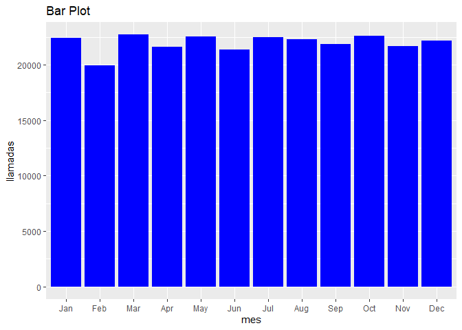

Laboratorio 5
================
Gabriela Martínez
2023-11-13

``` r
library(lubridate)
library(readxl)
library(nycflights13)
library(dplyr)
library(ggplot2)
```

# Inciso 1

``` r
#inciso 1 ---------------------------------------------------

eclipse0 <- 21082017182640

ecplise0 <- dmy_hms(eclipse0)

syn_month <- days(29) + hours(12) + minutes(44) + seconds(3)

saros <- syn_month *233

ecplise1 <- ecplise0 + saros

paste("el siguiente eclipse será el: ", ecplise1, "\n")
```

    ## [1] "el siguiente eclipse será el:  2036-06-23 09:30:19 \n"

# Inciso 2

``` r
data <- read_excel("data.xlsx")

#View(data)

names(data) <- c("fecha_creacion", "hora_creacion", "caller_ID", "motivo", "email", "sms", "llamada", "fecha_final", "hora_final")

data <- data %>% 
  mutate(
    fecha_creacion_origen = fecha_creacion,
    fecha_creacion = dmy(fecha_creacion),
    fecha_creacion_origen = as.Date(as.numeric(fecha_creacion_origen), origin = "1899-12-30"),
    fecha_final_origen = fecha_final,
    fecha_final = dmy(fecha_final),
    fecha_final_origen = as.Date(as.numeric(fecha_final_origen), origin = "1899-12-30")
  )

data <- data %>% 
  mutate(
    fecha_creacion_f = coalesce(fecha_creacion_origen, fecha_creacion),
    fecha_final_f = coalesce(fecha_final_origen, fecha_final)
  )

str(data)
```

    ## tibble [263,725 × 13] (S3: tbl_df/tbl/data.frame)
    ##  $ fecha_creacion       : Date[1:263725], format: NA "2017-03-19" ...
    ##  $ hora_creacion        : POSIXct[1:263725], format: "1899-12-31 22:18:36" "1899-12-31 17:35:32" ...
    ##  $ caller_ID            : num [1:263725] 368224 368224 368224 368224 748633 ...
    ##  $ motivo               : chr [1:263725] "Cancelaciones" "Otros/Varios" "Consultas" "Consultas" ...
    ##  $ email                : num [1:263725] 0 0 0 0 0 0 0 0 0 0 ...
    ##  $ sms                  : num [1:263725] 1 1 1 1 1 1 1 1 1 1 ...
    ##  $ llamada              : num [1:263725] 0 0 0 0 0 0 0 0 0 0 ...
    ##  $ fecha_final          : Date[1:263725], format: NA "2017-03-19" ...
    ##  $ hora_final           : POSIXct[1:263725], format: "1899-12-31 22:29:36" "1899-12-31 17:52:32" ...
    ##  $ fecha_creacion_origen: Date[1:263725], format: "2017-10-12" NA ...
    ##  $ fecha_final_origen   : Date[1:263725], format: "2017-10-12" NA ...
    ##  $ fecha_creacion_f     : Date[1:263725], format: "2017-10-12" "2017-03-19" ...
    ##  $ fecha_final_f        : Date[1:263725], format: "2017-10-12" "2017-03-19" ...

``` r
names(data)
```

    ##  [1] "fecha_creacion"        "hora_creacion"         "caller_ID"            
    ##  [4] "motivo"                "email"                 "sms"                  
    ##  [7] "llamada"               "fecha_final"           "hora_final"           
    ## [10] "fecha_creacion_origen" "fecha_final_origen"    "fecha_creacion_f"     
    ## [13] "fecha_final_f"

``` r
data <- data %>% 
  select(-c(fecha_creacion, fecha_final, fecha_creacion_origen, fecha_final_origen))

View(data)

# en que meses hay mayor cantidad de llamadas por motivo

llamadas_motivo_mes <- data %>% 
  select(motivo, fecha_creacion_f) %>% 
  group_by(motivo, month(fecha_creacion_f, label = TRUE)) %>% 
  summarise(n = n()) %>% 
  slice_max(n, with_ties = FALSE) 
```

    ## `summarise()` has grouped output by 'motivo'. You can override using the
    ## `.groups` argument.

``` r
print(llamadas_motivo_mes)
```

    ## # A tibble: 7 × 3
    ## # Groups:   motivo [7]
    ##   motivo                       `month(fecha_creacion_f, label = TRUE)`     n
    ##   <chr>                        <ord>                                   <int>
    ## 1 0                            Jul                                      1463
    ## 2 Actualización de Información May                                      1691
    ## 3 Cancelaciones                Mar                                      4092
    ## 4 Cobros                       Jan                                       688
    ## 5 Consultas                    Oct                                     10790
    ## 6 Empresarial                  Oct                                      3136
    ## 7 Otros/Varios                 Jan                                      1129

``` r
#que dia de la semana es mas ocupado 

llamadas_por_dia_semana <- data %>% 
  select(fecha_creacion_f) %>% 
  mutate(dia_de_semana = wday(fecha_creacion_f, label = TRUE)) %>% 
  group_by(dia_de_semana) %>% 
  summarise(llamadas_dia = n())  

print("El día más ocupado es el domingo")
```

    ## [1] "El día más ocupado es el domingo"

``` r
#que mes es mas ocupado 
llamadas_por_mes <- data %>% 
  select(fecha_creacion_f) %>% 
  group_by(month(fecha_creacion_f, label = TRUE)) %>% 
  summarise(llamadas_por_mes = n()) 

print("El mes más ocupado es marzo")
```

    ## [1] "El mes más ocupado es marzo"

``` r
#Existe una concentración o estacionalidad en la cantidad de llamadas

names(llamadas_por_mes) <- c("mes", "llamadas_por_mes")


ggplot(llamadas_por_mes, aes(x = mes, y = llamadas_por_mes)) +
  geom_bar(stat = "identity", fill = "blue") +
  labs(title = "Bar Plot", x = "mes", y = "llamadas")
```

<!-- -->

``` r
print("No se observa ninguna estacionalidad en cuanto al número de llamadas")
```

    ## [1] "No se observa ninguna estacionalidad en cuanto al número de llamadas"

``` r
#Cuántos minutos dura la llamada promedio

data <- data %>% 
  mutate(duracion_llamada = hora_final - hora_creacion)

llamada_promedio <- mean(data$duracion_llamada)

llamada_promedio <- llamada_promedio/60

paste("la llamada promedio dura ", round(llamada_promedio, digits = 2), "minutos")
```

    ## [1] "la llamada promedio dura  14.89 minutos"

``` r
#tabla de frecuencias con tiempo de llamada

tiempo_de_llamada <- data %>% 
  mutate(duracion_llamada = as.period(duracion_llamada, unit = "minutes")) %>% 
  group_by(duracion_llamada) %>% 
  summarise(num_llamadas = n())

print(tiempo_de_llamada)
```

    ## # A tibble: 31 × 2
    ##    duracion_llamada num_llamadas
    ##    <Period>                <int>
    ##  1 0S                       9706
    ##  2 1M 0S                    8741
    ##  3 2M 0S                    8508
    ##  4 3M 0S                    8445
    ##  5 4M 0S                    8513
    ##  6 5M 0S                    8413
    ##  7 6M 0S                    8501
    ##  8 7M 0S                    8420
    ##  9 8M 0S                    8576
    ## 10 9M 0S                    8504
    ## # ℹ 21 more rows

# Inciso 3

``` r
# Define the signos data frame
signos <- data.frame(signo = c("Aries", "Taurus", "Gemini", "Cancer", "Leo", "Virgo", "Libra", "Scorpio", "Sagittarius", "Capricorn", "Aquarius", "Pisces"),
                     inicio = as.Date(c("March 21", "April 20", "May 21", "June 21", "July 23", "August 23", "September 23", "October 23", "November 22", "December 22", "January 20", "February 19"), format = "%B %d"),
                     final = as.Date(c("April 19", "May 20", "June 20", "July 22", "August 22", "September 22", "October 22", "November 21", "December 21", "January 19", "February 18", "March 20"), format = "%B %d"))

# Function to get zodiac sign based on birthday (ignoring year)
signo_zodiacal <- function(fecha) {
  
  fecha <- as.Date(paste("2023", format(fecha, "%m-%d"), sep = "-"))
  
  for (i in 1:nrow(signos)) {
    if (fecha >= signos$inicio[i] && fecha <= signos$final[i]) {
      return(signos$signo[i])
    }
  }
}


cumpleaños <- as.Date("08-28", format = "%m-%d")
mi_signo <- signo_zodiacal(cumpleaños)
paste("Tu signo zodiacal es: ",mi_signo)
```

    ## [1] "Tu signo zodiacal es:  Virgo"

# Inciso 4

``` r
#View(flights)

vuelos <- flights %>% 
  mutate(
    departure = make_date(year,month,day),
    sched_departure_time = make_datetime(year,month,day,hour,minute)
  )

#View(vuelos)

vuelos <- vuelos %>% 
  mutate(
    arr_time_hora = arr_time%/%100,
    arr_time_min = arr_time%%100,
    dep_time_hora = dep_time%/%100,
    dep_time_min = dep_time%%100,
    sched_arr_time_hora = sched_arr_time%/%100,
    sched_arr_time_min = sched_arr_time%%100,
    sched_dep_time_hora = sched_dep_time%/%100,
    sched_dep_time_min = sched_dep_time%%100
  )

#View(vuelos)

vuelos <- vuelos %>% 
  mutate(
    arrival_time =make_datetime(year,month,day,arr_time_hora,arr_time_min),
    departure_time =make_datetime(year,month,day,dep_time_hora,dep_time_min),
    sched_arrival_time =make_datetime(year,month,day,sched_arr_time_hora,sched_arr_time_min)
  )

View(vuelos)

names(vuelos)
```

    ##  [1] "year"                 "month"                "day"                 
    ##  [4] "dep_time"             "sched_dep_time"       "dep_delay"           
    ##  [7] "arr_time"             "sched_arr_time"       "arr_delay"           
    ## [10] "carrier"              "flight"               "tailnum"             
    ## [13] "origin"               "dest"                 "air_time"            
    ## [16] "distance"             "hour"                 "minute"              
    ## [19] "time_hour"            "departure"            "sched_departure_time"
    ## [22] "arr_time_hora"        "arr_time_min"         "dep_time_hora"       
    ## [25] "dep_time_min"         "sched_arr_time_hora"  "sched_arr_time_min"  
    ## [28] "sched_dep_time_hora"  "sched_dep_time_min"   "arrival_time"        
    ## [31] "departure_time"       "sched_arrival_time"

``` r
vuelos <- vuelos %>% 
  select(-c(year, month, day, dep_time, sched_dep_time, arr_time, sched_arr_time, hour, minute, 
            time_hour, departure, arr_time_hora, arr_time_min, dep_time_hora, dep_time_min, sched_arr_time_hora,
            sched_arr_time_min, sched_dep_time_hora, sched_dep_time_min))

vuelos <- vuelos %>% 
  mutate(
    delay_total = dep_delay + arr_delay
  )

print(vuelos)
```

    ## # A tibble: 336,776 × 14
    ##    dep_delay arr_delay carrier flight tailnum origin dest  air_time distance
    ##        <dbl>     <dbl> <chr>    <int> <chr>   <chr>  <chr>    <dbl>    <dbl>
    ##  1         2        11 UA        1545 N14228  EWR    IAH        227     1400
    ##  2         4        20 UA        1714 N24211  LGA    IAH        227     1416
    ##  3         2        33 AA        1141 N619AA  JFK    MIA        160     1089
    ##  4        -1       -18 B6         725 N804JB  JFK    BQN        183     1576
    ##  5        -6       -25 DL         461 N668DN  LGA    ATL        116      762
    ##  6        -4        12 UA        1696 N39463  EWR    ORD        150      719
    ##  7        -5        19 B6         507 N516JB  EWR    FLL        158     1065
    ##  8        -3       -14 EV        5708 N829AS  LGA    IAD         53      229
    ##  9        -3        -8 B6          79 N593JB  JFK    MCO        140      944
    ## 10        -2         8 AA         301 N3ALAA  LGA    ORD        138      733
    ## # ℹ 336,766 more rows
    ## # ℹ 5 more variables: sched_departure_time <dttm>, arrival_time <dttm>,
    ## #   departure_time <dttm>, sched_arrival_time <dttm>, delay_total <dbl>
